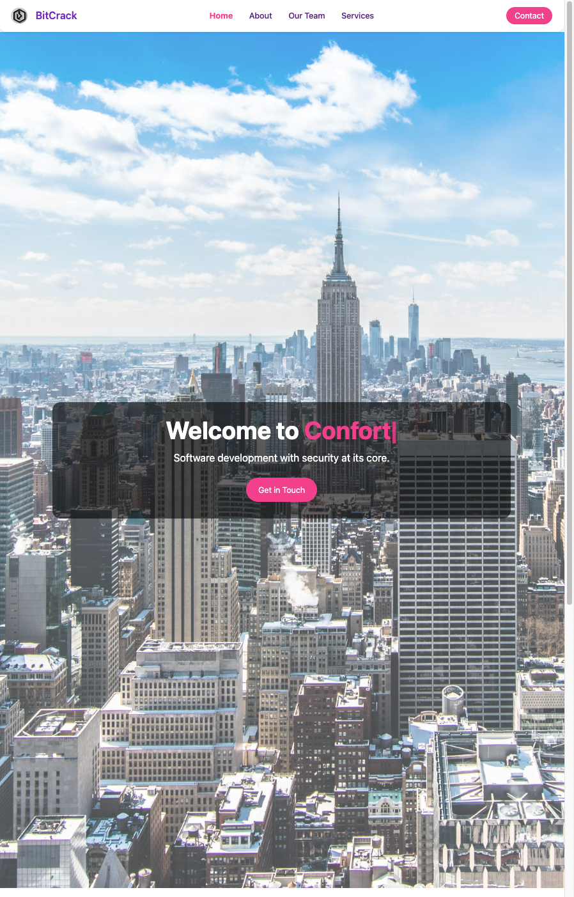
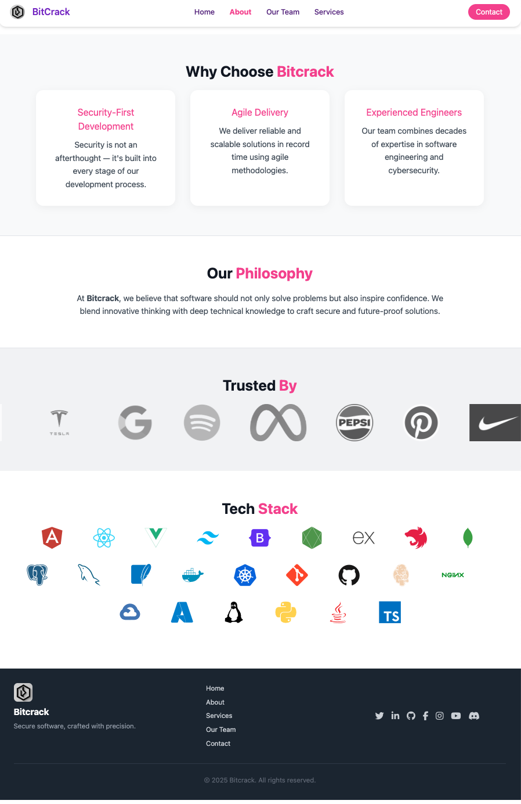
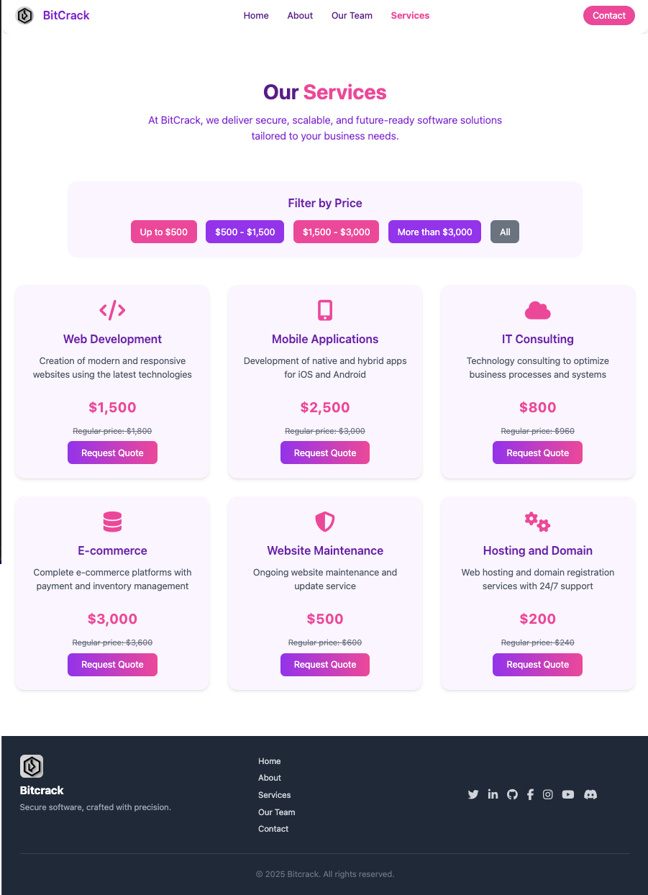
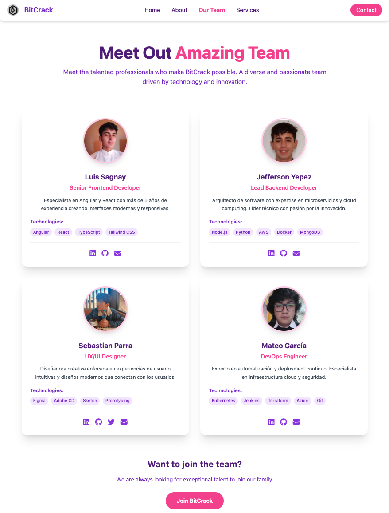
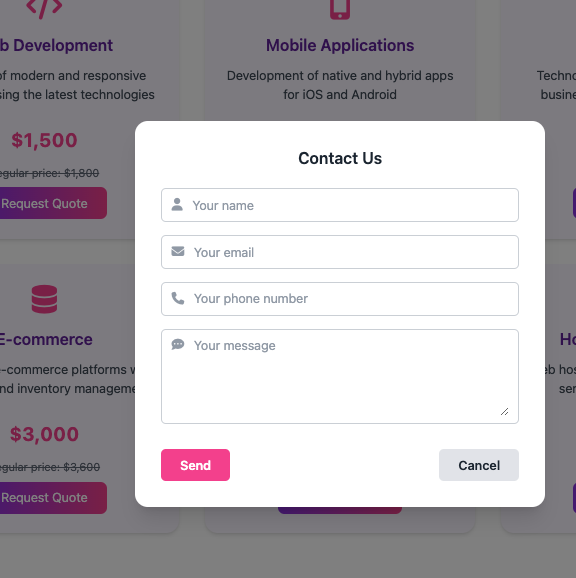

# BitCrack Web App

Una aplicación web moderna construida con Angular 19 que implementa principios de Clean Architecture y diseño modular.

## 🏗️ Arquitectura Clean UI

Este proyecto sigue los principios de Clean Architecture adaptados para el frontend, organizando el código en capas bien definidas:

### Estructura de Capas

- **Core**: Contiene la lógica de negocio central
  - `models/`: Entidades y modelos de datos
  - `services/`: Servicios de aplicación y lógica de negocio

- **Features**: Módulos funcionales organizados por características
  - `home/`: Página de inicio
  - `about/`: Página acerca de
  - `services/`: Página de servicios
  - `team/`: Página de equipo
  - `contact/`: Página de contacto

- **Shared**: Componentes y utilidades reutilizables
  - Componentes comunes
  - Pipes
  - Directivas
  - Utilidades

## 📁 Distribución de Carpetas

```
BitCrackWebApp/
├── src/
│   ├── app/
│   │   ├── core/                    # Lógica de negocio central
│   │   │   ├── models/              # Modelos de datos
│   │   │   └── services/            # Servicios de aplicación
│   │   ├── features/                # Módulos por características
│   │   │   ├── home/                # Página de inicio
│   │   │   ├── about/               # Página acerca de
│   │   │   ├── services/            # Página de servicios
│   │   │   ├── team/                # Página de equipo
│   │   │   └── contact/             # Página de contacto
│   │   ├── shared/                  # Componentes reutilizables
│   │   ├── app.component.*          # Componente raíz
│   │   ├── app.config.ts            # Configuración de la aplicación
│   │   └── app.routes.ts            # Configuración de rutas
│   ├── assets/                      # Recursos estáticos
│   ├── img/                         # Imágenes de la aplicación
│   ├── index.html                   # Página principal
│   ├── main.ts                      # Punto de entrada
│   └── styles.scss                  # Estilos globales
├── public/                          # Archivos públicos
├── dist/                            # Build de producción
├── docs/                            # Documentación generada
├── views/                           # Capturas de pantalla
├── Dockerfile                       # Configuración Docker
├── nginx.conf                       # Configuración Nginx
└── package.json                     # Dependencias y scripts
```

## 🚀 Pasos para Instalar

### Prerrequisitos

- Node.js (versión 18 o superior)
- Yarn (gestor de paquetes recomendado)
- Angular CLI (opcional pero recomendado)

### Instalación

1. **Clonar el repositorio**
   ```bash
   git clone <url-del-repositorio>
   cd BitCrackWebApp
   ```

2. **Instalar Yarn globalmente (si no lo tienes)**
   ```bash
   npm install -g yarn
   ```

3. **Instalar dependencias**
   ```bash
   yarn install
   ```

4. **Instalar Angular CLI globalmente (opcional)**
   ```bash
   yarn global add @angular/cli
   ```

5. **Ejecutar en modo desarrollo**
   ```bash
   yarn start
   # o
   ng serve
   ```

6. **Abrir en el navegador**
   - Navega a `http://localhost:4200`

## 🐳 Docker

### Crear la Imagen Docker

1. **Construir la aplicación para producción**
   ```bash
   yarn build
   ```

2. **Crear la imagen Docker**
   ```bash
   docker build -t bitcrack-webapp .
   ```

### Crear y Ejecutar el Contenedor

1. **Ejecutar el contenedor**
   ```bash
   docker run -d -p 80:80 --name bitcrack-container bitcrack-webapp
   ```

2. **Verificar que está funcionando**
   - Navega a `http://localhost`

3. **Comandos útiles de Docker**
   ```bash
   # Ver contenedores en ejecución
   docker ps
   
   # Detener el contenedor
   docker stop bitcrack-container
   
   # Eliminar el contenedor
   docker rm bitcrack-container
   
   # Ver logs del contenedor
   docker logs bitcrack-container
   ```

## 📦 Dependencias

### Dependencias de Producción

- **@angular/core**: ^19.0.0 - Framework principal de Angular
- **@angular/common**: ^19.0.0 - Módulos comunes de Angular
- **@angular/router**: ^19.0.0 - Sistema de enrutamiento
- **@angular/forms**: ^19.0.0 - Manejo de formularios
- **@angular/animations**: ^19.0.0 - Sistema de animaciones
- **zone.js**: ~0.15.0 - Detección de cambios
- **tslib**: ^2.3.0 - Biblioteca de utilidades TypeScript

### Dependencias de Desarrollo

- **@angular/cli**: ^19.0.6 - Herramientas de línea de comandos
- **@angular/compiler-cli**: ^19.0.0 - Compilador de Angular
- **typescript**: ~5.6.2 - Lenguaje TypeScript
- **karma**: ~6.4.0 - Test runner
- **jasmine-core**: ~5.4.0 - Framework de testing

## 🌐 CDNs y Recursos Externos

Este proyecto utiliza recursos locales y no depende de CDNs externos para su funcionamiento básico. Todas las dependencias se gestionan a través de Yarn.

## 🖼️ Capturas de Pantalla

El proyecto incluye capturas de pantalla de las diferentes vistas en la carpeta `views/`:

### Página de Inicio

*Vista principal de la aplicación con el diseño de bienvenida*

### Acerca de Nosotros

*Página con información sobre la empresa y el equipo*

### Servicios

*Catálogo de servicios ofrecidos por la empresa*

### Equipo

*Presentación del equipo de trabajo*

### Contacto

*Formulario de contacto y información de ubicación*

## 🛠️ Scripts Disponibles

```bash
# Desarrollo
yarn start                  # Inicia el servidor de desarrollo
yarn watch                  # Construye en modo watch

# Construcción
yarn build                  # Construye la aplicación para producción

# Testing
yarn test                   # Ejecuta las pruebas unitarias

# Angular CLI
ng serve                    # Servidor de desarrollo
ng build                    # Construcción
ng test                     # Pruebas
ng generate                 # Generador de código

# Gestión de dependencias
yarn add <package>          # Añadir dependencia
yarn add <package> --dev    # Añadir dependencia de desarrollo
yarn remove <package>       # Eliminar dependencia
yarn upgrade                # Actualizar dependencias
```

## 🌟 Características

- ✅ Angular 19 con las últimas características
- ✅ Arquitectura limpia y modular
- ✅ Diseño responsive
- ✅ Optimizado para producción
- ✅ Containerización con Docker
- ✅ Servidor Nginx para producción
- ✅ TypeScript para tipado estático
- ✅ SCSS para estilos avanzados

## � Features de Angular Utilizados

Este proyecto aprovecha las características más modernas de Angular 19:

### 🔄 Control Flow
- **@if** - Renderizado condicional moderno
- **@for** - Bucles optimizados para listas
- **@switch** - Múltiples condiciones de manera eficiente
- **@empty** - Estados vacíos en listas

### 🧩 Pipes
- **Pipes built-in**: `date`, `currency`

### 🔧 Services & Dependency Injection
- **ProvidedIn: 'root'** para servicios aplicación-wide

### 🎯 Reactive Forms
- **FormBuilder** para construcción de formularios
- **Validators** built-in y personalizados
- **FormControl**, **FormGroup**, **FormArray**
- **Dynamic forms** para formularios dinámicos

### 🛣️ Router & Navigation
- **Standalone components** routing


### 📱 Change Detection
- **OnPush strategy** para optimización
- **ChangeDetectorRef** para control manual
- **Signal-based reactivity** (Angular 19)

### 🆕 Standalone Components
- **Standalone architecture** sin NgModules
- **Direct imports** en componentes
- **Tree-shaking** mejorado
- **Bootstrapping** simplificado

### 🔍 Template Features
- **Template reference variables** (#ref)
- **Property binding** [property]
- **Event binding** (event)
- **Two-way binding** [(ngModel)]
- **Structural directives** personalizadas

### 🏗️ Lifecycle Hooks
- **OnInit** para inicialización
- **OnDestroy** para limpieza
- **OnChanges** para cambios de inputs
- **AfterViewInit** para acceso al DOM

## Imagen de docker
Para descargar la imagen de Docker, puedes usar el siguiente comando:

```bash
docker pull cotbert2/bitcrack
```

## �📝 Notas de Desarrollo

- El proyecto utiliza Angular 19 con las últimas características del framework
- Se implementa una arquitectura modular basada en features
- Los estilos están organizados con SCSS
- La aplicación está optimizada para despliegue en contenedores Docker
- Se utiliza Nginx como servidor web para producción

## 🔧 Configuración de Producción

La aplicación está configurada para desplegarse usando:
- **Docker** con una imagen basada en Nginx Alpine
- **Nginx** como servidor web estático
- **Construcción optimizada** con Angular CLI

## 📄 Licencia

Ver el archivo [LICENSE](LICENSE) para más detalles.